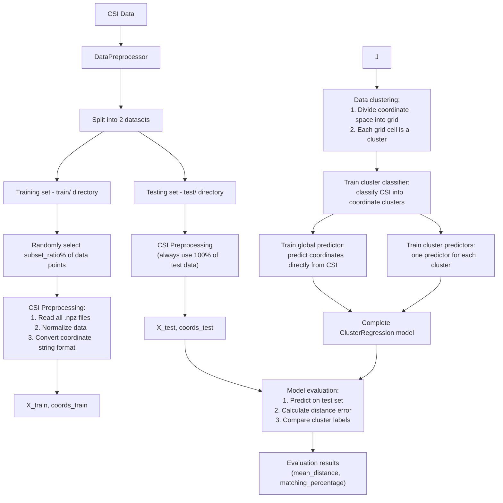
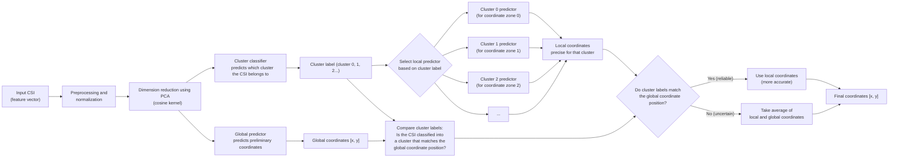

## Installation

Requirements:
- Python 3.8 or higher
- NumPy, Pandas, Scikit-learn, Matplotlib

## How the System Works

### 1. Process Overview

The system operates in 3 main phases:
1. **Data Loading and Processing**: Read CSI data from .npz files, divide into training and testing sets
2. **Model Training**: Cluster data and train predictors
3. **Position Prediction**: Use the model to predict coordinates from input CSI data

### 2. Detailed Data Processing Pipeline



### 3. Position Prediction Process



## Usage

### Evaluating Multiple Models

To evaluate and compare different position prediction models, use the command:

```bash
cd Final/Glo-Lobal
python evaluate_models.py [parameters]
```

### Important Parameters

- `--subset_ratio`: The proportion of data points used for training (0-1)
  - Example: `--subset_ratio 0.4` will randomly select 40% of the total data points from all files in the train/ directory
  - Note: All test data is always used 100% for fair evaluation

- `--classifier_types`: Specify the type of cluster classifier
  - Types: `knn` (K-Nearest Neighbors), `rf` (Random Forest), `svm` (Support Vector Machine)
  - Example: `--classifier_types knn rf` to test both KNN and Random Forest

- `--predictor_types`: Specify the type of coordinate predictor
  - Types: `knn`, `rf` (Random Forest), `svr` (Support Vector Regression), `gb` (Gradient Boosting)
  - Example: `--predictor_types knn svr rf` to test 3 types of predictors

- `--quick_test`: Only evaluate a few simple models for a quick check

- `--visualize`: Display comparison charts after evaluation

### Example Commands

```bash
# Evaluate with KNN as classifier and 3 different predictors, using 40% of training data
python evaluate_models.py --subset_ratio 0.4 --classifier_types knn --predictor_types knn svr rf --visualize

# Quick check with fewer models
python evaluate_models.py --subset_ratio 0.5 --quick_test
```

## Detailed Explanation of How It Works

### 1. Data Processing

The system processes CSI data from .npz files as follows:
- Read all .npz files from the train/ and test/ directories
- For each file, extract the CSI matrix and corresponding coordinates
- Coordinates can be in numeric or string format (e.g., '660x540')
- Convert string coordinates to numbers (e.g., [660, 540])
- Training set: Randomly select subset_ratio% of points from all train/ files
- Test set: Use 100% of points from all test/ files

### 2. Data Clustering

The system divides the coordinate space into square grid cells instead of using KMeans:
- Find the coordinate range (min, max) for both x and y
- Divide the space into a square grid (e.g., 2x2 = 4 clusters)
- Each coordinate is assigned to a cluster based on its position in the grid
- Train a classifier to predict which cluster a CSI belongs to

### 3. Position Prediction

The process of predicting a position from a new CSI sample:
1. Preprocess and reduce the dimensionality of CSI data
2. Classifier predicts which cluster the CSI belongs to (local label)
3. Global predictor predicts preliminary coordinates (global coordinates)
4. Corresponding cluster predictor predicts more accurate coordinates (local coordinates)
5. Compare local label with global label (based on global coordinates)
6. If the two labels match: use local coordinates (more accurate)
7. If they don't match: combine both coordinates to reduce error

